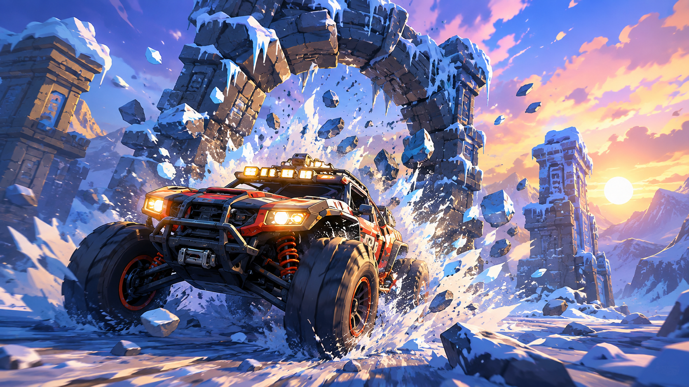

# Snowfield 🏎️❄️

A fully physics-simulated, open-world car driving experience built in a single HTML file using **Three.js** and **Rapier3D**.



## 🚀 Features

*   **Procedural Open World:** Infinite terrain generated using multi-octave Perlin noise, featuring different biomes (snow, sand, dirt) and water.
*   **Physics-Driven Car:** A full vehicle controller powered by Rapier3D, featuring suspension, steering, engine force, and realistic per-wheel grip.
*   **Interactive Environment:** Drive through destructible ruins with per-mesh physics colliders, and explore a world scattered with rocks, bushes, and ancient structures.
*   **Premium Graphics:** Built on the WebGPU renderer (fallback to WebGL) with ACES Filmic tone mapping, 4K soft shadows, exponential fog, and a beautiful golden-hour lighting setup.
*   **Dynamic Weather:** A real-time particle system rendering thousands of drifting snow and wind particles.
*   **Polished UI:** Glassmorphism settings panel, animated loading screen, and a live speedometer/boost HUD.

## 🛠️ Tech Stack

*   **[Three.js](https://threejs.org/):** WebGL/WebGPU 3D Rendering.
*   **[Rapier3D](https://rapier.rs/):** Fast, WebAssembly-based physics engine.
*   **[Vite](https://vitejs.dev/):** Frontend tooling and local development server.
*   **Assets:** Car and wheel models by [Kenney](https://kenney.nl/).

## 💻 Running Locally

To run the game locally, you'll need Node.js installed.

1.  Clone the repository:
    ```bash
    git clone https://github.com/Huzaifa-12Imran/Destruction.git
    cd Destruction
    ```

2.  Install dependencies:
    ```bash
    npm install
    ```

3.  Start the development server:
    ```bash
    npm run dev
    ```

4.  Open your browser and navigate to the local URL provided by Vite (usually `http://localhost:5173`).

## 🎮 Controls

*   **W / S** - Accelerate / Brake / Reverse
*   **A / D** - Steer Left / Right
*   **Shift** - Boost
*   **Space** - Jump (because why not?)
*   **R** - Reset Car Position
*   **P** - Toggle Physics Debug View
*   **O** - Toggle Orbit Controls (Free Camera)

## 🤝 Contributing

Feel free to fork the project and submit pull requests! Whether it's adding new features, optimizing performance, or tweaking the physics, contributions are welcome.

## 📜 License

This project is open-source and available under the [MIT License](LICENSE).
